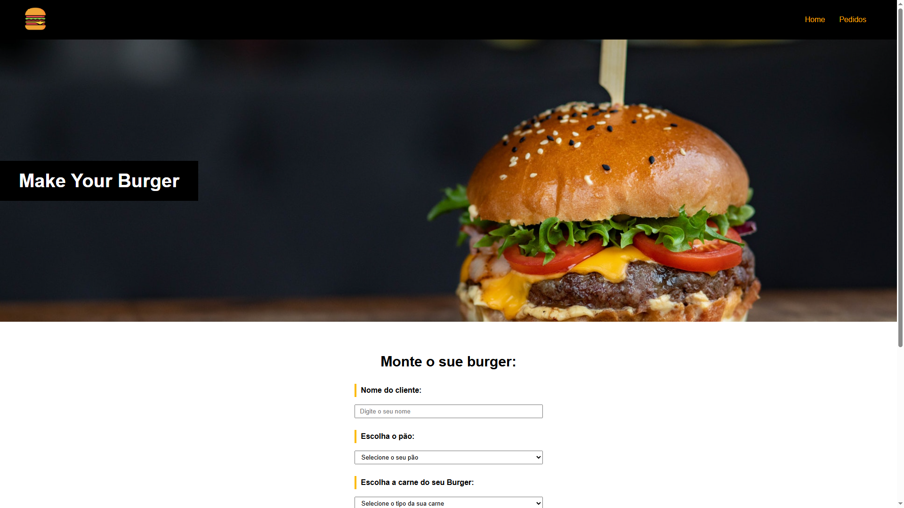
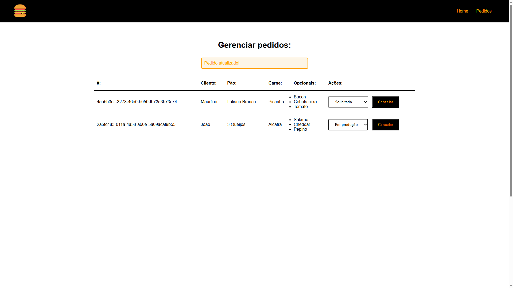

<div align="center"> <h1>Make Your Burguer</h1> </div>

<p align="center">Monte seu hambúrguer personalizado com essa aplicação interativa de pedidos!</p>

<p align="center">
  
  
  
  
  
</p>

## 📝 Sobre o projeto

Esta aplicação, desenvolvida com Vue.js no front-end e Node.js no back-end, permite que os usuários montem hambúrgueres personalizados e gerenciem seus pedidos. Utilizando a biblioteca Vuex para gerenciamento de estado, os usuários podem editar o status e excluir os pedidos.

## 🛠 Tecnologias utilizadas

-   **Vue.js** - Framework JavaScript progressivo
-   **Vuex** - Biblioteca de gerenciamento de estado
-   **JavaScript** - Linguagem de programação
-   **HTML** - Estrutura do conteúdo
-   **CSS** - Estilização da interface
-   **Tailwind CSS** - Framework de estilos

## 📸 Screenshots

<p align="center">
  
</p>

<p align="center">
  
</p>

## 🌐 Acesse o projeto online
Você pode acessar a versão online do projeto [aqui](https://make-your-burguer.netlify.app).

## 🖥️ Como configurar o projeto

Siga os passos abaixo para instalar e executar o projeto em seu ambiente local:

### 1. Clone o repositório:

```bash
$ git clone https://github.com/mauricio071/Make-Your-Burguer
```

### 2. Acesse o diretório do projeto:

```bash
$ cd Make-Your-Burguer
```

### 3. Instale as dependências necessárias:

```bash
$ npm install
```

### 4. Configure o ambiente:
Para que o front-end consiga consumir a API, primeiro instale o projeto da API [aqui](https://github.com/mauricio071/Make-Your-Burguer-api). Em seguida, ajuste o arquivo .env no projeto com a URL da API. Por exemplo:

```bash
VUE_APP_BASE_URL=http://localhost:3001/api
```

### 5. Inicialize o projeto:

```bash 
$ npm run serve
```
Agora você pode acessar o projeto no navegador em http://localhost:8080 (ou na porta indicada pelo terminal).
